# Dependency Graph (Code-Accurate)

Last verified against code on 2026-03-04.

This document is a source-level dependency graph for this repository. It maps:

- `make` target -> Python module
- module -> exact read/write artifacts
- transitive lineage for key deliverables (`monitoring_latest.json`, comprehensive report, investor memo)

All paths are repo-relative unless stated otherwise.

## Snapshot Lanes (Important)

There are two distinct snapshot lanes in current code:

1. `data/snapshots/external_review/<date>/...`
- Primary lane for deterministic evidence (`make evidence`) and monitoring (`make monitor_cycle`).

2. `data/snapshots/defillama/*.json`
- Timestamped API pull lane from `make snapshot` (`src.indexing.defillama`).
- Used by notebooks and ad hoc context; not automatically wired into the default `make evidence` target.

## Legend

- `[R]` = reads
- `[W]` = writes
- `*optional*` = module handles missing file and continues with fallback behavior
- `timestamped` = filename includes runtime timestamp

## 1) Top-Level Execution Graph

```mermaid
flowchart TD
  A[make registry] --> A1[src.registry.discover]
  A1 --> A2[data/contracts/registry.csv]

  B[make snapshot] --> B1[src.indexing.defillama]
  B1 --> B2[data/snapshots/defillama/*.json]

  C[make refresh_claims] --> C1[src.indexing.claims_refresh]
  C1 --> C2[data/snapshots/external_review/.../base_rpc_distributor_claimed_*.json]
  C1 --> C3[data/snapshots/external_review/.../base_rpc_receipt_*.json]
  C1 --> C4[data/snapshots/external_review/.../manifest_claim_refresh_latest.json]

  D[make refresh_lvusdc_nav] --> D1[src.indexing.lvusdc_nav_refresh]
  D1 --> D2[data/snapshots/external_review/.../base_rpc_lvusdc_convertToAssets_*.json]

  E[make evidence] --> E1[src.analysis.evidence]
  E1 --> E2[results/proofs/evidence_*/...]

  F[make v2_workflow] --> F1[src.analysis.v2_workflow]
  F1 --> F2[results/tables/v2_*.json/csv/md]
  F1 --> F3[results/charts/v2_*.png]
  F1 --> F4[results/proofs/evidence_*/ticket_closure_workflow.*]

  G[make monitor_cycle] --> C
  G --> D
  G --> E
  G --> F
  G --> G1[src.analysis.monitor_cycle]
  G1 --> G2[results/tables/monitoring_cycles.csv]
  G1 --> G3[results/tables/monitoring_latest.json]
  G1 --> G4[results/tables/monitoring_latest.md]

  H[make analyze] --> H1[src.analysis.metrics]
  H --> H2[src.analysis.scenarios]
  H2 --> H3[results/tables/scenario_assumptions_*.json]
  H2 --> H4[results/tables/scenario_matrix_*.json/csv/md]

  I[make freeze_baseline] --> I1[src.analysis.baseline_freeze]
  I1 --> I2[results/tables/baseline_manifest_*.json]
  I1 --> I3[results/tables/baseline_manifest_latest.json]

  J[make report] --> J1[src.analysis.report_sync]
  J1 --> J2[paper/report.md]
  J --> J3[src.analysis.comprehensive_report]
  J3 --> J4[paper/comprehensive_value_accrual_report.md]
  J --> J5[src.analysis.investor_extended]
  J5 --> J6[data/snapshots/investor_external/*]
  J5 --> J7[results/tables/investor_*]
  J5 --> J8[results/charts/investor_*]
  J --> J9[src.analysis.investor_pack]
  J9 --> J10[paper/investor_executive_summary.md]
  J9 --> J11[results/tables/investor_key_metrics + scenario tables]
  J9 --> J12[results/charts/investor_*]
  J --> J13[src.analysis.investor_latex]
  J13 --> J14[paper/investor_executive_summary.tex]
```

## 2) Module I/O Matrix

## 2.1 Registry / Indexing

### `src.registry.discover` (`make registry`)
- `[W]` `data/contracts/registry.csv`
- Note: only seeds two known addresses; discovery methods are stubbed (`NotImplementedError`).

### `src.indexing.defillama` (`make snapshot`)
- `[W]` `data/snapshots/defillama/lazy-summer-protocol_tvl_<timestamp>.json`
- `[W]` `data/snapshots/defillama/summer.fi_tvl_<timestamp>.json`
- `[W]` `data/snapshots/defillama/lazy-summer-protocol_fees_<timestamp>.json`

### `src.indexing.claims_refresh` (`make refresh_claims`)
- `[R]` `data/snapshots/external_review/.../manifest_claim_refresh_latest.json` *optional existing history append*
- `[W]` `data/snapshots/external_review/.../base_rpc_distributor_claimed_{usdc|lvusdc|abasusdc}_{from}_{to}.json`
- `[W]` `data/snapshots/external_review/.../base_rpc_distributor_claimed_{usdc|lvusdc|abasusdc}_{from}_latest.json`
- `[W]` `data/snapshots/external_review/.../base_rpc_receipt_<tx_hash>.json` for SIP tx list
- `[W]` `data/snapshots/external_review/.../manifest_claim_refresh_latest.json` (default name)

### `src.indexing.lvusdc_nav_refresh` (`make refresh_lvusdc_nav`)
- `[R]` `data/snapshots/external_review/.../base_rpc_distributor_claimed_lvusdc_{from}_latest.json` (or dated variant)
- `[R]` `data/snapshots/external_review/.../tx_<SIP3.13.1_tx>.json` *optional*
- `[R]` `data/snapshots/external_review/.../base_rpc_receipt_<SIP3.13.1_tx>.json` *optional*
- `[W]` `data/snapshots/external_review/.../base_rpc_lvusdc_convertToAssets_{from}_{to}.json`
- `[W]` `data/snapshots/external_review/.../base_rpc_lvusdc_convertToAssets_latest.json`
- `[W]` `data/snapshots/external_review/.../base_rpc_lvusdc_convertToAssets_{from}_latest.json`

## 2.2 Deterministic Evidence Builder

### `src.analysis.evidence` (`make evidence`)

### Required snapshot inputs (`[R]`)
- `defillama_protocol_lazy_summer.json`
- `defillama_protocol_summer_fi.json`
- `defillama_fees_dailyFees_lazy_summer.json`
- one of:
  - `base_blockscout_tipjar_txs_all.json` or `base_blockscout_tipjar_base_txs.json`
  - `arb_blockscout_tipjar_txs_all.json` or `arb_blockscout_tipjar_arb_txs.json`
  - `eth_blockscout_tipjar_txs_all.json` or `eth_blockscout_tipjar_eth_txs.json`
- `base_blockscout_treasury_token_transfers_all.json`
- `eth_blockscout_treasury_token_transfers_all.json`
- `base_blockscout_foundation_tipstream_token_transfers_all.json`
- `summer_forum_sip3_13.json`
- `summer_forum_sip3_13_1.json`
- `base_blockscout_grm_rewardAdded_all.json`
- `base_blockscout_stsumr_contract.json`
- `base_blockscout_summerstaking_contract.json`

### Optional snapshot inputs (`[R]`)
- `manifest.json`, `manifest_paginated.json`, `manifest_paginated_core.json` (for as-of metadata)
- `base_rpc_supply_and_receipts.json`
- `tx_<SIP3.13_tx>.json`
- `tx_<SIP3.13.1_tx>.json`
- `base_rpc_distributor_claimed_usdc_40757499_41932732.json`
- `base_rpc_distributor_claimed_usdc_41932733_latest.json`
- `base_rpc_distributor_claimed_lvusdc_41932733_latest.json`
- `base_rpc_distributor_claimed_abasusdc_41932733_latest.json`
- `base_rpc_receipt_<SIP3.13_tx>.json`
- `base_rpc_receipt_<SIP3.13.1_tx>.json`
- `base_rpc_lvusdc_convertToAssets_latest.json` (or other `*_latest` variants)
- `tx_<known_sample_tx>.json` sample set (for transfer decode evidence)
- `base_rpc_distributor_claimed_*.json` glob (campaign attribution)

### Outputs (`[W]`) in `results/proofs/evidence_<snapshot_name>/`
- Core context:
  - `kpi_summary.json`
  - `defillama_context_summary.json`
- TipJar activity:
  - `base_tipjar_method_counts.csv`
  - `arbitrum_tipjar_method_counts.csv`
  - `ethereum_tipjar_method_counts.csv`
  - `tipjar_method_counts_combined.json`
- Treasury flow:
  - `base_treasury_fee_token_inflows.csv`
  - `base_treasury_fee_token_outflows.csv`
  - `eth_treasury_fee_token_inflows.csv`
  - `eth_treasury_fee_token_outflows.csv`
  - `base_foundation_tipstream_fee_token_outflows.csv`
  - `treasury_fee_token_net_flow_monthly.csv`
  - `treasury_outflow_summary.json`
  - `treasury_flow_summary.json`
- Forum parsing:
  - `forum_payout_claims.csv`
  - `forum_payout_ratios.csv`
- Contract/emissions/supply evidence:
  - `grm_rewardAdded_events.csv`
  - `contract_source_checks.json`
  - `sumr_supply_snapshot.json` *optional*
  - `base_sample_tx_transfer_decodes.csv` *optional*
- Payout chain + attribution:
  - `payout_chain_sip3_13_summary.json` *optional, if tx snapshot exists*
  - `payout_chain_sip3_13_1_summary.json` *optional, if tx snapshot exists*
  - `payout_chain_sip3_13_claimed_usdc_events.csv` *optional*
  - `payout_attribution_sip3_13_claim_events.csv` *conditional*
  - `payout_attribution_sip3_13_1_claim_events.csv` *conditional*
  - `payout_attribution_summary.json`
  - `payout_attribution_cycle_table.csv`
  - `staker_revenue_canonical_summary.json`
  - `payout_attribution_gate.json`
- Source-of-funds and discrepancies:
  - `source_of_funds_monthly_comparison.csv`
  - `source_of_funds_summary.json`
  - `discrepancy_tickets.json`
  - `discrepancy_tickets.csv`
- Emissions vs revenue:
  - `emissions_vs_revenue_decomposition.json`
  - `emissions_vs_revenue_decomposition_table.csv`
- Documentation:
  - `README.md`

### Internal evidence dependencies (important)
- `source_of_funds_summary.json` depends on generated `staker_revenue_canonical_summary.json`.
- `discrepancy_tickets.*` depend on generated `payout_chain_*_summary.json` and `payout_attribution_summary.json` when present.
- `emissions_vs_revenue_decomposition.*` depend on generated:
  - `grm_rewardAdded_events.csv`
  - `staker_revenue_canonical_summary.json`
  - `payout_attribution_summary.json`
  - `payout_attribution_<campaign>_claim_events.csv` (for LVUSDC claim valuation)

## 2.3 v2 Workflow / Gates

### `src.analysis.v2_workflow` (`make v2_workflow`)

### Inputs (`[R]`)
- `results/proofs/evidence_*/discrepancy_tickets.json`
- `results/proofs/evidence_*/payout_attribution_gate.json`
- `results/proofs/evidence_*/payout_attribution_summary.json`
- `results/proofs/evidence_*/emissions_vs_revenue_decomposition.json`

### Outputs (`[W]`)
- In evidence dir:
  - `ticket_closure_workflow.csv`
  - `ticket_closure_workflow.json`
- In `results/tables/`:
  - `v2_gate_passed_kpis.json`
  - `v2_gate_passed_cycles.csv`
  - `v2_gate_passed_kpis.md`
  - `v2_gate_validated_scenarios.json`
  - `v2_gate_validated_scenarios.csv`
  - `v2_gate_validated_scenarios.md`
  - `v2_bounded_decision_bands.json`
  - `v2_bounded_decision_bands.csv`
  - `v2_bounded_decision_bands.md`
  - `v2_workflow_summary.json`
- In `results/charts/`:
  - `v2_gate_passed_revenue_components.png`
  - `v2_gate_passed_claim_efficiency.png`
  - `v2_gate_validated_scenarios.png`
  - `v2_bounded_decision_bands.png`

## 2.4 Scenario / Monitoring / Baseline

### `src.analysis.scenarios` (`make analyze`, second command)
- `[R]` `results/proofs/evidence_*/kpi_summary.json` (default)
- `[R]` `data/snapshots/external_review/.../base_rpc_supply_and_receipts.json` (default)
- `[R]` `data/snapshots/external_review/.../scenario_assumptions_pin.json` *optional*
- `[W]` `results/tables/scenario_assumptions_<timestamp>.json`
- `[W]` `results/tables/scenario_assumptions_latest.json`
- `[W]` `results/tables/scenario_matrix_<timestamp>.json`
- `[W]` `results/tables/scenario_matrix_latest.json`
- `[W]` `results/tables/scenario_matrix_<timestamp>.csv`
- `[W]` `results/tables/scenario_matrix_latest.csv`
- `[W]` `results/tables/scenario_matrix_latest.md`

### `src.analysis.metrics` (`make analyze`, first command)
- Pure functions only; no file I/O side effects.

### `src.analysis.monitor_cycle` (`make monitor_cycle`, final step)
- `[R]` snapshot: `manifest_claim_refresh_latest.json`
- `[R]` evidence:
  - `payout_chain_sip3_13_1_summary.json`
  - `payout_attribution_cycle_table.csv`
  - `payout_attribution_gate.json`
  - `discrepancy_tickets.json`
- `[R]` tables:
  - `v2_workflow_summary.json`
  - `v2_bounded_decision_bands.json` *optional*
  - `baseline_manifest_latest.json` *optional*
  - `scenario_assumptions_latest.json` *optional*
- `[W]` `results/tables/monitoring_cycles.csv` (append)
- `[W]` `results/tables/monitoring_latest.json`
- `[W]` `results/tables/monitoring_latest.md`

### `src.analysis.baseline_freeze` (`make freeze_baseline`)
- `[R]` full `results/` tree
- `[R]` `results/tables/monitoring_latest.json` *optional context*
- `[W]` `results/tables/baseline_manifest_<timestamp>.json`
- `[W]` `results/tables/baseline_manifest_latest.json`

## 2.5 Reporting

### `src.analysis.report_sync` (`make report`, step 1)
- `[R]` `results/tables/monitoring_latest.json`
- `[R]` evidence:
  - `kpi_summary.json`
  - `discrepancy_tickets.json`
  - `payout_chain_sip3_13_1_summary.json`
- `[R]` tables:
  - `v2_bounded_decision_bands.json` *optional*
  - `scenario_assumptions_latest.json` *optional*
- `[R/W]` `paper/report.md` (replaces `<!-- BEGIN AUTO_FACTS --> ... <!-- END AUTO_FACTS -->`)

### `src.analysis.comprehensive_report` (`make report`, step 2)
- `[R]` `results/tables/monitoring_latest.json`
- `[R]` evidence:
  - `kpi_summary.json`
  - `defillama_context_summary.json`
  - `discrepancy_tickets.json`
  - `payout_attribution_summary.json`
  - `staker_revenue_canonical_summary.json`
  - `payout_attribution_gate.json`
  - `source_of_funds_summary.json`
  - `emissions_vs_revenue_decomposition.json`
  - `source_of_funds_monthly_comparison.csv`
- `[R]` tables:
  - `v2_workflow_summary.json`
  - `v2_bounded_decision_bands.json`
  - `scenario_assumptions_latest.json`
  - `scenario_matrix_latest.json`
  - `baseline_manifest_latest.json` *optional*
- `[W]` `paper/comprehensive_value_accrual_report.md`

### `src.analysis.investor_extended` (`make report`, step 3)

#### Reads (`[R]`)
- `results/tables/monitoring_latest.json`
- `results/tables/scenario_matrix_latest.json`
- `results/tables/scenario_assumptions_latest.json`
- `results/tables/v2_bounded_decision_bands.json`
- evidence:
  - `kpi_summary.json`
  - `base_treasury_fee_token_outflows.csv`
  - `base_treasury_fee_token_inflows.csv`
  - `source_of_funds_monthly_comparison.csv`
  - `emissions_vs_revenue_decomposition.json`
  - `sumr_supply_snapshot.json`
- static contract ABI snapshot:
  - `data/snapshots/external_review/2026-02-09-independent/base_blockscout_summerstaking_contract.json`

#### Network/API reads
- DeFiLlama protocol and fees endpoints (peer + macro sets)
- DeFiLlama coins endpoint (WETH)
- DexScreener SUMR price
- Base RPC calls (treasury balances, staking state calls)
- Base Blockscout logs (staking event address discovery)

#### Writes (`[W]`)
- snapshot bundle:
  - `data/snapshots/investor_external/<timestamp>/...`
  - `data/snapshots/investor_external/latest_manifest.json`
- tables:
  - `results/tables/investor_external_benchmark_peers.json/csv`
  - `results/tables/investor_macro_context.json`
  - `results/tables/investor_macro_top_lending_30d_fees.csv`
  - `results/tables/investor_probability_weighted_pnl.json`
  - `results/tables/investor_probability_weighted_pnl_paths.csv`
  - `results/tables/investor_probability_weighted_pnl_expected.csv`
  - `results/tables/investor_treasury_runway_model.json/csv`
  - `results/tables/investor_staking_distribution.json`
  - `results/tables/investor_staking_positions_snapshot.csv`
  - `results/tables/investor_staking_lockup_distribution.csv`
  - `results/tables/investor_staking_remaining_distribution.csv`
  - `results/tables/investor_staking_top_stakers.csv`
  - `results/tables/investor_upside_plausibility_indicators_<timestamp>.json/csv`
  - `results/tables/investor_upside_plausibility_indicators_latest.json/csv`
  - `results/tables/investor_verified_vs_external_reconciliation_<timestamp>.json/csv`
  - `results/tables/investor_verified_vs_external_reconciliation_latest.json/csv`
  - `results/tables/investor_price_context_refresh_<timestamp>.json/csv`
  - `results/tables/investor_price_context_refresh_latest.json/csv`
  - `results/tables/investor_probability_weighted_pnl_price_refresh_<timestamp>.json/csv`
  - `results/tables/investor_probability_weighted_pnl_price_refresh_latest.json/csv`
  - `results/tables/investor_extended_summary.json`
- charts:
  - `results/charts/investor_external_peer_benchmarks.png`
  - `results/charts/investor_macro_lending_fee_league.png`
  - `results/charts/investor_probability_weighted_pnl_paths.png`
  - `results/charts/investor_treasury_runway_base_opex.png`
  - `results/charts/investor_staking_lockup_distribution.png`

### `src.analysis.investor_pack` (`make report`, step 4)

#### Reads (`[R]`)
- `results/tables/monitoring_latest.json`
- evidence:
  - `kpi_summary.json`
  - `discrepancy_tickets.json`
  - `source_of_funds_summary.json`
  - `emissions_vs_revenue_decomposition.json`
  - `defillama_context_summary.json`
  - `payout_attribution_summary.json`
  - `source_of_funds_monthly_comparison.csv`
- tables:
  - `v2_bounded_decision_bands.json`
  - `scenario_assumptions_latest.json`
  - `scenario_matrix_latest.json`
  - `investor_probability_weighted_pnl_paths.csv`
  - optional context tables from `investor_extended` and legacy generators:
    - `investor_external_benchmark_peers.json`
    - `investor_macro_context.json`
    - `investor_treasury_runway_model.json`
    - `investor_staking_distribution.json`
    - `investor_probability_weighted_pnl.json`
    - `investor_probability_weighted_pnl_price_refresh_latest.json`
    - `investor_extended_summary.json`
    - `investor_tokenomics_snapshot_latest.json` *optional*
    - `investor_staking_assumptions_latest.json` *optional*
    - `investor_upside_plausibility_indicators_latest.json` *optional*
    - `investor_verified_vs_external_reconciliation_latest.csv` *optional*
    - `investor_unlock_schedule_next_24m_latest.csv` *optional*
    - `investor_onchain_address_map_latest.csv` *optional*
    - `investor_security_posture_latest.csv` *optional*
    - `investor_liquidity_market_structure_latest.csv` *optional*
- snapshot dir (from monitoring payload):
  - `defillama_protocol_lazy_summer.json`
  - `defillama_fees_dailyFees_lazy_summer.json`

#### Writes (`[W]`)
- markdown:
  - `paper/investor_executive_summary.md`
- tables:
  - `results/tables/investor_scenario_quantiles.json`
  - `results/tables/investor_key_metrics.json`
  - `results/tables/investor_reference_scenarios.csv`
  - `results/tables/investor_staking_sensitivity.csv`
- charts:
  - `results/charts/investor_tvl_fees_trend.png`
  - `results/charts/investor_campaign_realization.png`
  - `results/charts/investor_source_of_funds_monthly.png`
  - `results/charts/investor_scenario_yield_heatmap.png`
  - `results/charts/investor_scenario_yield_distribution.png`
  - `results/charts/investor_reference_scenarios.png`
  - `results/charts/investor_probability_weighted_pnl_paths.png`

### `src.analysis.investor_latex` (`make report`, step 5)
- `[R]` `paper/investor_executive_summary.md`
- `[W]` `paper/investor_executive_summary.tex`
- `[W]` `paper/investor_executive_summary.pdf` *only when `--compile` or `make investor_pdf`*

## 3) Critical Transitive Lineage

## 3.1 `results/tables/monitoring_latest.json`

Direct lineage:

1. `claims_refresh` -> claim snapshots + `manifest_claim_refresh_latest.json`
2. `lvusdc_nav_refresh` -> LVUSDC NAV snapshots
3. `evidence` -> payout/source/discrepancy artifacts
4. `v2_workflow` -> gate/bounded workflow summary
5. `monitor_cycle` reads all above and writes `monitoring_latest.json`

## 3.2 `paper/comprehensive_value_accrual_report.md`

`comprehensive_report` consumes:

- `monitoring_latest.json`
- evidence package (`kpi_summary`, payout attribution, canonical revenue, gate, source-of-funds, emissions)
- table package (`v2_workflow_summary`, `v2_bounded_decision_bands`, `scenario_*`, optional baseline manifest)

Output is fully synthesized markdown report.

## 3.3 `paper/investor_executive_summary.md`

`investor_pack` consumes:

- same core evidence + scenario tables + monitoring
- extended market artifacts from `investor_extended` when present
- snapshot-level DeFiLlama JSON from `monitoring.snapshot_dir`

Then writes memo markdown + visualization set.

## 4) Implicit Prerequisites and Ordering Constraints

These are real dependency constraints in current code:

1. `make report` does **not** call `make analyze`.
- `investor_extended` and `investor_pack` require `results/tables/scenario_matrix_latest.json` and `scenario_assumptions_latest.json`.
- If those files are absent or stale, reports can fail or use stale scenario assumptions.

2. `monitor_cycle` depends on `manifest_claim_refresh_latest.json`.
- This comes from `refresh_claims`; running `monitor_cycle` directly via the script without refresh may fail.

3. `report_sync` requires `paper/report.md` markers:
- `<!-- BEGIN AUTO_FACTS -->`
- `<!-- END AUTO_FACTS -->`

4. `investor_extended` hardcodes one ABI snapshot path for staking:
- `data/snapshots/external_review/2026-02-09-independent/base_blockscout_summerstaking_contract.json`

## 5) Scaffold / Non-Active Modules (Current State)

These modules are present but not full production data lanes:

- `src.indexing.events` (log indexing stub)
- `src.indexing.snapshots` (`get_end_of_day_block` stub)
- `src.processing.fees` (stub)
- `src.processing.revenue` (stub)
- `src.processing.staking` (stub)
- `src.registry.discover` non-seed discovery methods (stubs)

Also:
- `src.analysis.metrics` and `src.reconciliation.checks` are function libraries with no CLI output artifacts by default.
- `make index` currently runs `src.indexing.events`, which is scaffolded and does not emit indexed parquet artifacts yet.
- `make reconcile` runs `src.reconciliation.checks`, which defines check helpers but no artifact-writing CLI workflow.

## 6) Recommended Cold-Start Rebuild Order

For clean, dependency-safe regeneration:

1. `make refresh_claims`
2. `make refresh_lvusdc_nav`
3. `make evidence`
4. `make v2_workflow`
5. `make analyze`
6. `make monitor_cycle`
7. `make freeze_baseline` (optional but recommended for reproducibility pinning)
8. `make report`

This order matches actual artifact requirements in code.
